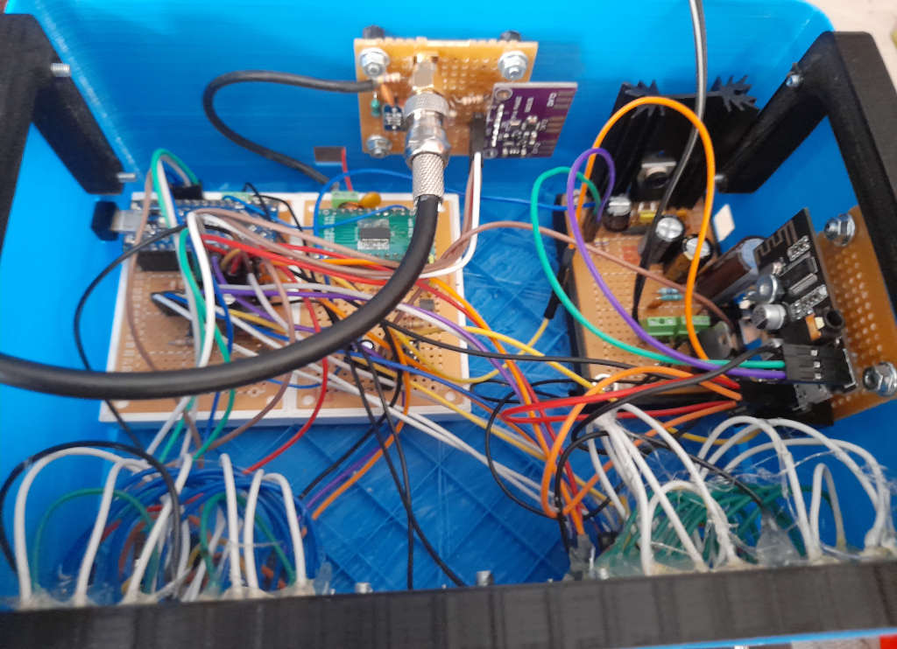

# AviationRadio
Aviation inspired radio using an Arduino + Si4844

It can receive broadcast FM and VHF AM, including the civil aviation airband, (using a downconverter based on SA612 + Si5351)

It also works as a flight sim peripheral, currently with an X-Plane 11 plugin (Linux only) for controlling the plane radios.

# TODO 
- documentation
- BOM
- Redesign the 3D printed box (current printed version is very rough quality)

# Initial working prototype pictures

